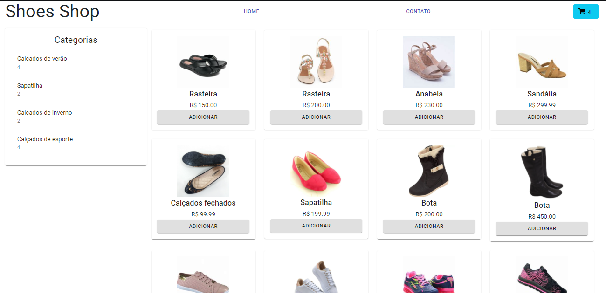

# E-commerce de uma loja de calçados femininos

Projeto desenvolvido com a instrutora Nathally Souza.

## Ferramentas Utilizadas:
. **Javascript**

. **React com Redux**

. **Bootstrap**

## Visual do projeto

  

## Links Úteis
MATERIAL-UI. Biblioteca de componentes React para um desenvolvimento ágil e fácil.

https://v4.mui.com/pt

